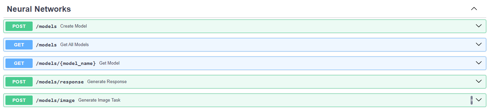

# Neuromesh
API + TG Bot to access to AI models

## Project features
* Subscription system
* Centralized logging with Loki and Grafana
* Clean Architecture
* RabbitMQ as a tasks queue
* Text generation
* Image generation

## How to run

* Set variables in `.env` like in `.env.example`:
    ```python
    POSTGRES_HOST=
    POSTGRES_PORT=
    POSTGRES_USER=
    POSTGRES_PASSWORD=
    POSTGRES_DB=

    API_KEY_KADINSKY=
    API_SECRET_KEY_KADINSKY=

    AUTH_DATA_SBER=
    CLIENT_ID_SBER=
    CLIENT_SECRET_SBER=

    API_KEY_CHATGPT=
    API_KEY_GEMINI=
    BROKER_URL=


    BOT_TOKEN=
    HEAD_ADMIN_TG_ID=


    RABBITMQ_USER=
    RABBITMQ_PASSWORD=
    RABBITMQ_HOST=
    RABBITMQ_PORT=
    ```
### Production
* Run `make prod` or `docker compose -f docker-compose.production.yml up -d`

### Development
* Run `make dev` or `docker compose up -d`

## API Routes
* Users 
* Subscriptions 
* Neural Networks 
## Centralized logs with Grafana Loki
You can set up logs at http://localhost:3000
* Add Loki Datasource
* Add Loki logs to Dashboard

