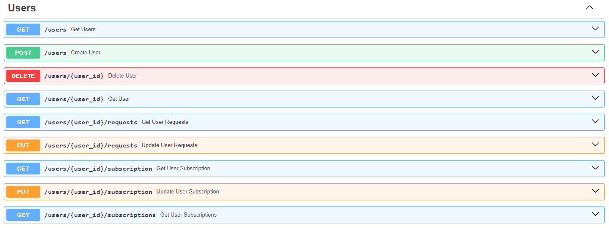
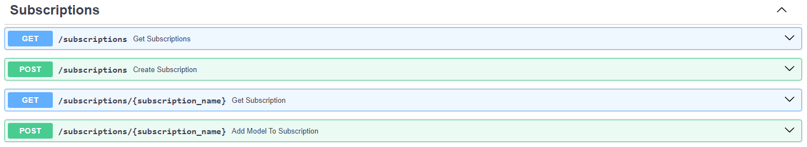

# Neuromesh
API + TG Bot to access to AI models

## Project features
* User subscriptions
* Clean Architecture
* RabbitMQ as a message brocker for microservices
* Text generation
* Image generation

## How to run
1. Set RabbitMQ environment variables `./.env`
    ```
    RABBITMQ_USER=
    RABBITMQ_PASSWORD=
    RABBITMQ_HOST=
    RABBITMQ_PORT=
    ```
    Set API environment variables `./api/.env`
    ```
    MODE=

    POSTGRES_HOST=
    POSTGRES_PORT=
    POSTGRES_USER=
    POSTGRES_PASSWORD=
    POSTGRES_DB=

    API_KEY_KADINSKY=
    API_SECRET_KEY_KADINSKY=

    AUTH_DATA_SBER=
    CLIENT_ID_SBER=
    CLIENT_SECRET_SBER=

    API_KEY_CHATGPT=
    ```
    Set Bot environment variables `./tgbot/.env`
    ```
    BOT_TOKEN=
    ```

2. Run `make app` or `docker compose up -d` in the project directory

## API Routes
* Users 
* Subscriptions 
* Neurak Networks 

